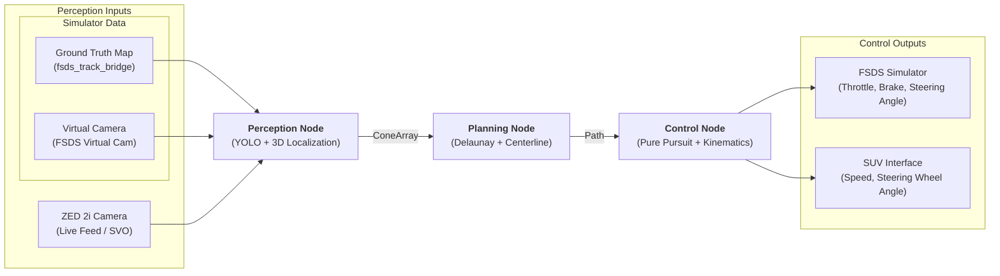

# Cone Follower - Electric SUV Autonomous Navigation

This project implements an autonomous cone-following system for an electric SUV using ROS 2, computer vision (YOLO + ZED SDK), and classical path planning/control algorithms.

## Project Overview

The goal is to enable an electric SUV to navigate through a course defined by cones. The system detects cones in 3D space, generates a optimal centerline path, and calculates the necessary steering and speed commands to follow that path.

### System Architecture



### Hardware & Deployment
- **Development Environment:** Mac or Remote Ubuntu Workstation with GPU (no sensor attached).
- **Deployment Platform:** Ubuntu Laptop + ROS 2 + GPU (mounted on the vehicle).
- **Primary Sensor:** ZED 2i camera for 2D bounding box generation and 3D spatial coordinate extraction.
### Software Stack
- **Perception:** YOLO (trained on FSOCO v2) for 2D detection + ZED Object Detection API (Custom Detector) for 3D localization.
- **Planning:** Delaunay Triangulation for track mapping and centerline generation.
- **Control:** Adaptive Pure Pursuit for trajectory following and steering wheel angle calculation.
- **Simulation:** Formula Student Driverless Simulator (FSDS) for high-fidelity vehicle dynamics and sensor emulation.
- **Actuation:** Proprietary Python package for low-level vehicle control (steering wheel angle and speed).

---

## 7-Week Development Roadmap

### Phase 1: Logic & Simulation (Weeks 1-3) - [COMPLETED]
*Goal: Build the "Perfect World" logic in software.*
- **[x] Week 1: Mock Data & Path Planning**
  - Implement Delaunay Triangulation to generate track centerlines from synthetic 3D points.
- **[x] Week 2: Control System & Kinematics**
  - Implement Adaptive Pure Pursuit and map vehicle steering to steering wheel angles. *(Note: Implementation complete; fine-tuning in progress)*
- **[x] Week 3: ROS 2 Architecture & Visualization**
  - Integrate nodes with FSDS and RViz 2 to verify control and planning in a closed-loop simulation.

### Phase 2: Perception & Reality (Week 5) - [COMPLETED]
*Goal: Handle "Messy World" sensor data.*
- **[ ] Week 4: 2D Perception (YOLO)** - *[SKIPPED: Transitioned directly to 3D integration]*
  - Train YOLO on FSOCO v2 dataset; validate using FSDS virtual camera streams.
- **[x] Week 5: 3D Perception (ZED API Integration)**
  - Process ZED `rosbag` files and FSDS spatial data to bridge 2D boxes into 3D coordinates.
  - **Implemented `zed_yolo_tf_node`** for real-time 3D cone localization from ZED Object Detection data.


---

## Prerequisites

Before setting up the workspace, ensure you have the following tools installed:

### 1. Just (Command Runner)
`just` is used to automate builds, simulation, and deployment tasks.
- **Ubuntu/Debian:** 
  ```bash
  sudo apt install just
  ```
- **Pre-compiled Binary (Recommended):**
  ```bash
  curl --proto '=https' --tlsv1.2 -sSf https://just.systems/install.sh | bash -s -- --to /usr/local/bin
  ```

### 2. Direnv (Environment Management)
`direnv` automatically sources the ROS 2 environment and workspace whenever you enter the project directory.
- **Install:**
  ```bash
  sudo apt install direnv
  ```
- **Shell Hook:** Add the following to your `~/.bashrc` (or `~/.zshrc`):
  ```bash
  eval "$(direnv hook bash)"
  ```
- **Authorize:** Once installed, run `direnv allow` in the project root to enable automatic sourcing.

---

## Development Workflow
Use the provided `justfile` and `direnv` (.envrc) to manage the ROS 2 environment and build processes. (Install `justfile` and `direnv` first)

1. **Setup Workspace:** Run `just setup` to clone the FSDS repository, configure dependencies (e.g., Eigen, COLCON_IGNORE), and symlink the `settings.json` to `~/Documents/AirSim`.
2. **Download Simulator:** Run `just download-fsds` to fetch the pre-compiled FSDS binary (Linux).
3. **Build:** Run `just build` to compile the workspace, including the `fsds_ros2_bridge` and `zed_yolo_tf_node`.

### Running the Simulation
To run the full autonomous stack in simulation (FSDS):

1. **Terminal 1 (FSDS):** `just run-fsds TrainingMap` (or `SmallTrack`, `Skidpad`)
2. **Terminal 2 (Stack):** `just launch-sim [viz]`

### Running with ZED Data (Rosbag or Live)
To run the perception stack using ZED sensor data:

1. **Terminal 1 (Data):** Play a `rosbag` file via ZED ROS 2 wrapper or connect live camera.
2. **Terminal 2 (Stack):** `just launch-zed`

The `just launch-zed` command handles the `zed_yolo_tf_node`, planning, visualization, and opens RViz.

---

**Visualization Options (Simulation):**
- `just launch-sim true` (default): Opens RViz with a camera-focused view including Cam1 (color) and Depth Camera (scaled 0-20m).
- `just launch-sim false`: Opens RViz with the standard track visualization (cones and centerline).

**In RViz 2:**
- The configuration is automatically loaded based on your `viz` choice.
- **Depth Visualization:** The depth camera image is pre-scaled in the `cameras.rviz` config. If viewing manually, ensure **Normalize Range** is off and set the range to 0.0 - 20.0 for best contrast.

---

### Camera Configuration
The system is configured with a depth camera for perception testing. The `settings.json` (found in `tools/FSDS/`) includes:
- `cam1`: Standard RGB camera.
- `depth_cam`: Depth camera (ImageType 2) mounted centrally for spatial mapping.

### Legacy/Individual Node Execution
If you need to verify specific components or run the mock track (no FSDS required):

- **Mock Track (Standalone):** `just run-simulation`
- **ZED Perception Only:** `just launch-zed`
- **Individual Nodes:** See `justfile` for `run-planning`, `run-control`, `run-viz`, etc.

---

### Phase 3: Hardware Handshake & Field Testing (Weeks 6-7) - [IN PROGRESS]
*Goal: Deploy to the vehicle and optimize.*
- **[x] Week 6: Deployment & Actuation**
  - **Implemented `vehicle_interface_node`** with secure DoIP/UDS handshake and 5-step reset sequence.
  - **Integrated Steering Activation Handshake** (3-step) and safety delta guards (95° limit) to prevent EPS dissociation.
  - **Implemented Speed Toggle** via steering wheel 'Trip' button (dead-man switch) and software-defined blinking for turn lamps.

- **Week 7: Field Testing & Tuning**
  - Perform real-world track testing, latency profiling, and parameter refinement.
