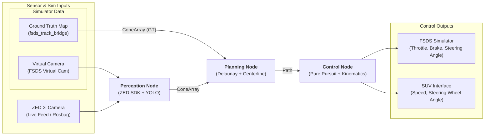

# Cone Follower - Electric SUV Autonomous Navigation

This project implements an autonomous cone-following system for an electric SUV using ROS 2, computer vision (YOLO + ZED SDK), and classical path planning/control algorithms.

## Project Overview

The goal is to enable an electric SUV to navigate through a course defined by cones. The system detects cones in 3D space, generates a optimal centerline path, and calculates the necessary steering and speed commands to follow that path.

### System Architecture



### Hardware & Deployment
- **Development Environment:** Ubuntu Workstation with GPU (Remote).
- **Deployment Platform:** Ubuntu Laptop + ROS 2 + GPU (mounted on the vehicle).
- **Primary Sensor:** ZED 2i camera for 3D spatial coordinate extraction.
### Software Stack
- **Framework:** ROS 2 (Humble) as the primary middleware and communication layer.
- **Perception:** YOLO + ZED Object Detection API (Custom Detector) for 3D localization.
- **Planning:** Delaunay Triangulation for track mapping and centerline generation.
- **Control:** Adaptive Pure Pursuit for trajectory following and steering wheel angle calculation.
- **Simulation:** Formula Student Driverless Simulator (FSDS) for high-fidelity vehicle dynamics and sensor emulation.
- **Actuation:** Proprietary Python package for low-level vehicle control (steering wheel angle and speed).

---

## Usage by Use Case

### 1. Mock Track Evaluation (Centerline Only)
*Use this to test the Delaunay triangulation and path smoothing logic without the simulator or camera.*
- **Command:** `just run-simulation`
- **What it does:** Publishes a static set of 3D cone points. You should also run `just run-planning` and `just run-viz` to see the generated centerline in RViz.

### 2. Simulator Driving (Ground Truth Cones)
*Use this to evaluate the Adaptive Pure Pursuit controller and path planning in a closed-loop environment.*
- **Step 1 (Simulator):** `just run-fsds TrainingMap`
- **Step 2 (Stack):** `just launch-sim false`
- **What it does:** Uses the simulator's internal "map" to provide perfect cone coordinates to the planner. Bypasses perception to isolate control/planning performance.
- Demo Video: [YouTube link](https://youtu.be/IipHGM0J3D0?si=R8dTyqCfrm4ses3f) / [Google Drive link](https://drive.google.com/file/d/1FfGchQ7Cq-Om5PTYDIYxig15oGlC0ZDh/view?usp=sharing)

### 3. Simulator Full Stack (Camera Perception) - *[UNDER DEVELOPMENT]*
*Use this to test the end-to-end pipeline, including virtual camera processing and 3D localization.*
- **Step 1 (Simulator):** `just run-fsds TrainingMap`
- **Step 2 (Stack):** `just launch-sim true`
- **What it does:** Enables the virtual camera stream and depth mapping. The system must detect and localize cones itself before planning a path.

### 4. Real-World Perception (Camera Only)
*Use this to validate the ZED YOLO TF node and cone localization using live or recorded data.*
- **Live/Rosbag:** Play a ZED `rosbag` or connect the camera.
- **Perception Launch:** `just launch-zed`
- **What it does:** Runs the YOLO detector and spatial mapping. Visualizes localized 3D cones in RViz.

### 5. Real-World Deployment (Vehicle Integration)
*Use this for final deployment on the physical electric SUV or for logic testing via Dry Run.*
- **Handshake:** Ensure the steering wheel **Trip** button is ready (dead-man switch).
- **Full Stack Launch:** `just launch-real-world`
- **Dry Run (No Vehicle):** `just real_dry_run=true launch-real-world`

#### CLI Options
You can customize the real-world launch by passing variables before the recipe:
| Variable | Default | Description |
| :--- | :--- | :--- |
| `real_dry_run` | `false` | If `true`, bypasses vehicle connection and logs drive commands. |
| `real_perception` | `true` | Set to `false` to skip the ZED YOLO perception node (e.g., if using mock data). |
| `real_viz` | `true` | Set to `false` to disable RViz. |
| `real_odom` | `/zed/zed_node/odom` | The odometry topic to use for planning and control. |

**Example:** `just real_dry_run=true real_viz=false launch-real-world`

- **What it does:** Consolidates perception, planning, control, and vehicle interface into a single command.
 Maps ROS steering/speed commands to the SUV's ECU via DoIP/UDS. Includes mandatory safety handshakes and torque/angle limits. In **Dry Run** mode, hardware communication is bypassed, allowing full stack validation on development laptops.

---

## 7-Week Development Roadmap

### Phase 1: Logic & Simulation (Weeks 1-3) - [COMPLETED]
*Goal: Build the "Perfect World" logic in software.*
- **[x] Week 1: Mock Data & Path Planning**
- **[x] Week 2: Control System & Kinematics** (PID Speed Control & Adaptive Lookahead)
- **[x] Week 3: ROS 2 Architecture & Visualization**

### Phase 2: Perception & Reality (Week 4-5) - [COMPLETED]
*Goal: Handle "Messy World" sensor data.*
- **[ ] Week 4: 2D Perception (YOLO)** - *[SKIPPED: Transitioned directly to 3D integration]*
  - Train YOLO on FSOCO v2 dataset; validate using FSDS virtual camera streams.
- **[x] Week 5: 3D Perception (ZED API Integration)**
  - Implemented `zed_yolo_tf_node` for real-time 3D cone localization.

### Phase 3: Hardware Handshake & Field Testing (Weeks 6-7) - [IN PROGRESS]
- **[x] Week 6: Deployment & Actuation**
  - Integrated Steering Activation Handshake and safety delta guards.
- **[ ] Week 7: Field Testing & Tuning**
  - Parameter refinement and real-world track testing.

---

## Prerequisites & Setup

1. **Environment:** Install ROS 2 (Humble), `rosdep`, `just` (command runner) and `direnv` (env manager).
2. **Authorize Environment:** Run `direnv allow` in the project root to initialize the Python virtual environment and source ROS 2.
3. **Initialize:** Run `just setup` to clone submodules and install all ROS 2 (system) and Python (pip) dependencies.
4. **Simulator:** Run `just download-fsds` to fetch the FSDS binary.
5. **Build:** Run `just build` to compile the workspace.


### Environment Tools Installation Instruction

Before setting up the workspace, ensure you have the following tools installed:

#### 1. Just (Command Runner)
`just` is used to automate builds, simulation, and deployment tasks.
- **Ubuntu/Debian:** 
  ```bash
  sudo apt install just
  ```
- **Pre-compiled Binary (Recommended):**
  ```bash
  curl --proto '=https' --tlsv1.2 -sSf https://just.systems/install.sh | bash -s -- --to /usr/local/bin
  ```

#### 2. Direnv (Environment Management)
`direnv` automatically sources the ROS 2 environment and workspace whenever you enter the project directory.
- **Install:**
  ```bash
  sudo apt install direnv
  ```
- **Shell Hook:** Add the following to your `~/.bashrc` (or `~/.zshrc`):
  ```bash
  eval "$(direnv hook bash)"
  ```
- **Authorize:** Once installed, run `direnv allow` in the project root to enable automatic sourcing.

#### 3. ROS 2 & Rosdep
This project is built using ROS 2 Humble Hawksbill.
- **Install ROS 2:** Follow the [official ROS 2 Humble installation guide](https://docs.ros.org/en/humble/Installation.html).
- **Initialize Rosdep:** `rosdep` is used to manage system dependencies.
  ```bash
  sudo apt install python3-rosdep
  sudo rosdep init
  rosdep update
  ```
