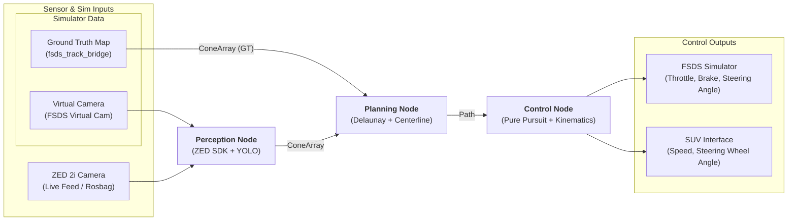
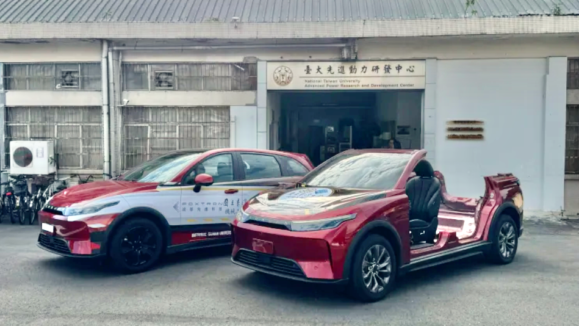
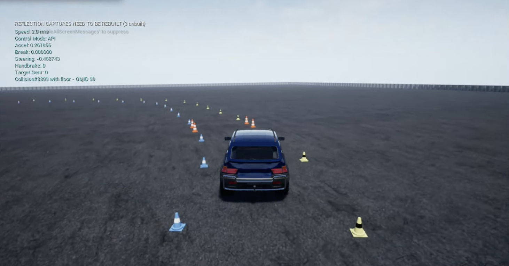

# Cone Follower - Electric SUV Autonomous Navigation

This project implements an autonomous cone-following system for an electric SUV using ROS 2, computer vision (YOLO + ZED SDK), and classical path planning/control algorithms.

## Project Overview

The goal is to enable an electric SUV to navigate through a course defined by cones. The system detects cones in 3D space, generates a optimal centerline path, and calculates the necessary steering and speed commands to follow that path.

### System Architecture

### Gallery

| Real-World Vehicle (Luxgen n7) | FSDS Simulator Environment |
| :---: | :---: |
|  |  |

### Hardware & Deployment
- **Development Environment:** Ubuntu Workstation with GPU (Remote).
- **Deployment Platform:** Ubuntu Laptop + ROS 2 + GPU (mounted on the vehicle).
- **Primary Sensor:** ZED 2i camera for 3D spatial coordinate extraction.
### Software Stack
- **Framework:** ROS 2 (Humble) as the primary middleware and communication layer.
- **Perception:** YOLO + ZED Object Detection API (Custom Detector) for 3D localization.
- **Planning:** Delaunay Triangulation for track mapping and centerline generation.
- **Control:** Adaptive Pure Pursuit for trajectory following and steering wheel angle calculation.
- **Simulation:** Formula Student Driverless Simulator (FSDS) for high-fidelity vehicle dynamics and sensor emulation.
- **Actuation:** Proprietary Python package for low-level vehicle control (steering wheel angle and speed).

---

## Documentation

For more detailed information, please refer to the following documents:

- **[Usage Guide](docs/USAGE.md):** Detailed instructions on how to run the system in different use cases (simulation, mock track, real-world).
- **[Development Roadmap](docs/ROADMAP.md):** The 7-week project timeline and progress.
- **[Prerequisites & Setup](docs/PREREQUISITES.md):** System requirements and workspace initialization instructions.
