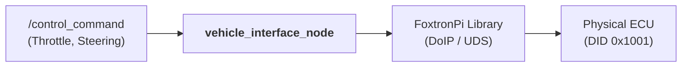

# Vehicle Interface Implementation Plan

This package bridges ROS 2 control commands (`/control_command`) to the physical FoxtronPi vehicle using the proprietary `foxtronpi-pyclient` library.

## Objective
Implement a ROS 2 node that handles the secure DoIP/UDS handshake, executes the mandatory vehicle reset sequence, and translates ROS commands into the vehicle's specific APS (Autonomous Parking System) control signals.

## Implementation Architecture

## Implementation Steps

### 1. Dependencies Integration
The package will be self-contained by copying the following files from `foxtronpi-pyclient` into the package module directory:
- `FoxPi_write.py`, `FoxPi_read.py`
- `client_config.cpython-310-x86_64-linux-gnu.so`
- `common.cpython-310-x86_64-linux-gnu.so`

*Note: The node must run on x86-64 due to these binary dependencies.*

### 2. Node Setup & Secure Handshake
The `vehicle_interface_node` will establish a connection following the `aps_control.py` logic:
1.  **Initialize DoIP Client:** `DoIPClient(DOIP_SERVER_IP, DoIP_LOGICAL_ADDRESS, protocol_version=3)`.
2.  **Establish UDS Connector:** `DoIPClientUDSConnector(doip_client)`.
3.  **Open UDS Client:** `udsoncan.Client(uds_connection, config=get_uds_client())`.
4.  **Gain Control authority:** Execute the **5-step Reset Sequence** (`FoxPi_Reset_Sequence()`):
    - `Ctrl_Enable_Switch` -> 1
    - `Driving_Ctrl` (DID 0x1001) -> 0xFF (21 bytes)
    - `Driving_Ctrl` (DID 0x1001) -> 0x00 (21 bytes)
    - `Ctrl_Enable_Switch` -> 0
    - `Ctrl_Enable_Switch` -> 1 ("Armed")
5.  **Enable APS Mode:** Shift to Drive (`APSShiftPosnReq=5`) and set `APSVMCReqA_flg=1`, `APSStaSystem=2` before processing any ROS commands.

### 3. Control Mapping Strategy
Translates the `cone_follower_msgs/ControlCommand` into the 14-value array required by `FoxPi_Driving_Ctrl`:
- **Speed:** Ignore variable throttle inputs and maintain a **fixed speed of 1 km/h** (`APSSpeedCMD` = 1).
- **Steering:** Map normalized ROS steering (`-1.0` to `1.0`) to steering wheel angle (`-360.0` to `+360.0` degrees).
  - *Calculation:* `TargetWheelAngle = control_msg.steering * 360.0`.
- **APS Configuration:** Set `APSVMCReqA_flg=1` (Applicable), `APSStaSystem=2` (Active), and `APSShiftPosnReq=5` (Drive).

### 4. Periodic Monitoring
- **Feedback Loop:** Periodically read and log vehicle status (Speed, Steering Angle, Torque Source) via `FoxPi_read.py` for telemetry and debugging.

### 5. Safety & Shutdown Sequence
A shutdown handler will be implemented to ensure the vehicle stops safely when the node is terminated:
1. Set speed to `0` km/h.
2. Shift to Park (`APSShiftPosnReq=2`).
3. Disable APS control.
4. Set `Ctrl_Enable_Switch` to `0`.

## Verification Tasks
- [ ] Successfully build with binary dependencies.
- [ ] Confirm "Armed" status via console logs.
- [ ] Verify car moves at 1 km/h in a controlled test field.
- [ ] Test graceful shutdown sequence.
