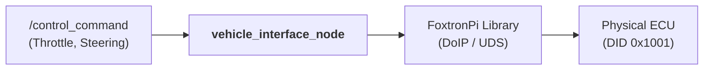

# Vehicle Interface Implementation Plan

This package bridges ROS 2 control commands (`/control_command`) to the physical FoxtronPi vehicle using the proprietary `foxtronpi-pyclient` library.

## Objective
Implement a ROS 2 node that handles the secure DoIP/UDS handshake, executes the mandatory vehicle reset sequence, and translates ROS commands into the vehicle's specific APS (Autonomous Parking System) control signals.

## Implementation Architecture

## Implementation Steps

### 1. Dependencies Integration
The package is self-contained and includes the following files from `foxtronpi-pyclient`:
- `FoxPi_write.py`, `FoxPi_read.py`
- `client_config.cpython-310-x86_64-linux-gnu.so`
- `common.cpython-310-x86_64-linux-gnu.so`

*Note: The node must run on x86-64 when connecting to hardware due to these binary dependencies. However, it can run on any architecture in **Dry Run** mode (see section 7).*

### 2. Node Setup & Secure Handshake
The `vehicle_interface_node` establishes a connection following this logic:
1.  **Initialize DoIP Client:** `DoIPClient(DOIP_SERVER_IP, DoIP_LOGICAL_ADDRESS, protocol_version=3)`.
2.  **Establish UDS Connector:** `DoIPClientUDSConnector(doip_client)`.
3.  **Open UDS Client:** `udsoncan.Client(uds_connection, config=get_uds_client())`.
4.  **Gain Control authority:** Execute the **5-step Reset Sequence** (`FoxPi_Reset_Sequence()`):
    - `Ctrl_Enable_Switch` -> 1
    - `Driving_Ctrl` (DID 0x1001) -> 0xFF (21 bytes)
    - `Driving_Ctrl` (DID 0x1001) -> 0x00 (21 bytes)
    - `Ctrl_Enable_Switch` -> 0
    - `Ctrl_Enable_Switch` -> 1 ("Armed")
5.  **Enable APS Mode:** Shift to Drive (`APSShiftPosnReq=5`) and set `APSVMCReqA_flg=1`, `APSStaSystem=2`.
6.  **Initialize Lamps:** Set Position Lamp and Turn Lamps to **Steady ON** to indicate "Armed/Idle" status.

### 3. Steering Control Handshake & Constraints
Before sending steering commands, a specific sequence must be followed to activate the Electronic Power Steering (EPS) angle control.

#### Steering Activation Sequence
1. **Pre-condition:** Ensure `Torque_V`, `Torque_Req`, and `Torque` are all disabled (set to `0`).
2. **Step A:** Write `Angle_V=1`, `Angle_Req=0`, `Angle=0`.
3. **Step B:** Wait **200ms**, then write `Angle_V=1`, `Angle_Req=1`, `Angle=0`.
4. **Step C:** Once initialized, subsequent commands write `Angle_V=1`, `Angle_Req=1`, `Angle=<Target Angle>`.

#### Safety Constraints & Dissociation
The EPS will dissociate (stop responding) if any of these conditions are met:
- **Angle Delta:** Difference between `Target Angle` and `Current SAS Angle` > **100 degrees**.
- **Angular Velocity:** Steering speed > **500 deg/s**.
- **Range:** Angle exceeds **±450 degrees** (Operational limit is ±360).
- **Inertia:** Steering wheel torque/inertia > **3 Nm** (Driver intervention).

If dissociation occurs, reset by setting `Angle_V`, `Angle_Req`, and `Angle` to `0`, then restart from Step A.

### 4. Control & Lamp Logic

#### Control Mapping
Translates `fs_msgs/ControlCommand` into the 14-value array (`driving_ctrl_values`) for `FoxPi_Driving_Ctrl`:
- **Speed:** Toggled between **0 km/h** and **1 km/h** via the Steering Wheel **Trip** button.
  - *Dead-man switch:* Node starts at 0 km/h. First press of Trip button enables 1 km/h movement.
- **Steering:** Map normalized ROS steering (`-1.0` to `1.0`) to wheel angle (`-360.0` to `+360.0`).
  - **Delta Guard:** Target is clamped to within 95° of current `SAS_Angle` to prevent dissociation.

#### Lamp Control (Software-Defined Blinking)
- **Position Lamp:** Always **Steady ON** after ARMED.
- **Turn Lamps (Hazard Mode):**
    - **Idle (0 km/h):** Steady ON (Hazard indicator).
    - **Moving (1 km/h):** Blinking at **2Hz** (Software-controlled toggle).

### 5. Periodic Monitoring
- **Feedback Loop:** The node periodically (2Hz) reads and logs vehicle status via `FoxPi_read.py`:
    - `VehicleSpeed` (DID 0x1002)
    - `SAS_Angle` (DID 0x1005) - **Required for Steering Delta Check**
    - `SWC_Trip_Sta` (DID 0x1006) - **Required for Speed Toggle**
    - `TqSource` (DID 0x1010)

### 6. Safety & Shutdown Sequence
A shutdown handler ensures the vehicle stops safely:
1. Set speed to `0` km/h.
2. Shift to Park (`APSShiftPosnReq=2`).
3. Disable APS control flags.
4. Set `Ctrl_Enable_Switch` to `0`.
5. Turn OFF all lamps.

### 7. Dry Run & CLI Options
For logic validation without a physical vehicle or x86-64 environment:
- **Primary Command:** `just real_dry_run=true launch-real-world`

#### Customizable Variables
The `just launch-real-world` recipe supports several global variables for customization:
- `real_dry_run` (default: `false`): Enables hardware-free simulation.
- `real_perception` (default: `true`): Toggles the ZED YOLO perception node.
- `real_viz` (default: `true`): Toggles RViz 2.
- `real_odom` (default: `/zed/zed_node/odom`): Sets the odometry input source.

**Usage:** `just real_dry_run=true real_perception=false launch-real-world`

- **Dry Run Behavior:**
    - Skips DoIP/UDS connection and hardware reset sequence.
    - Sets `steering_activated = True` immediately.
    - Mocks status monitoring (SAS Angle, Speed, etc.).
    - Logs target steering and speed to the console instead of writing to CAN.
    - Uses lazy imports to avoid crashes on machines without the proprietary `.so` libraries.

## Verification Tasks
- [x] Successfully build with binary dependencies.
- [x] Confirm "Armed" status via console logs.
- [x] Verify Dry Run mode works without hardware connection.
- [x] Verify Trip button toggles target speed.
- [x] Verify turn lamps blink when moving and are steady when idle.
- [x] Test graceful shutdown sequence (shifting to Park and clearing lamps).

